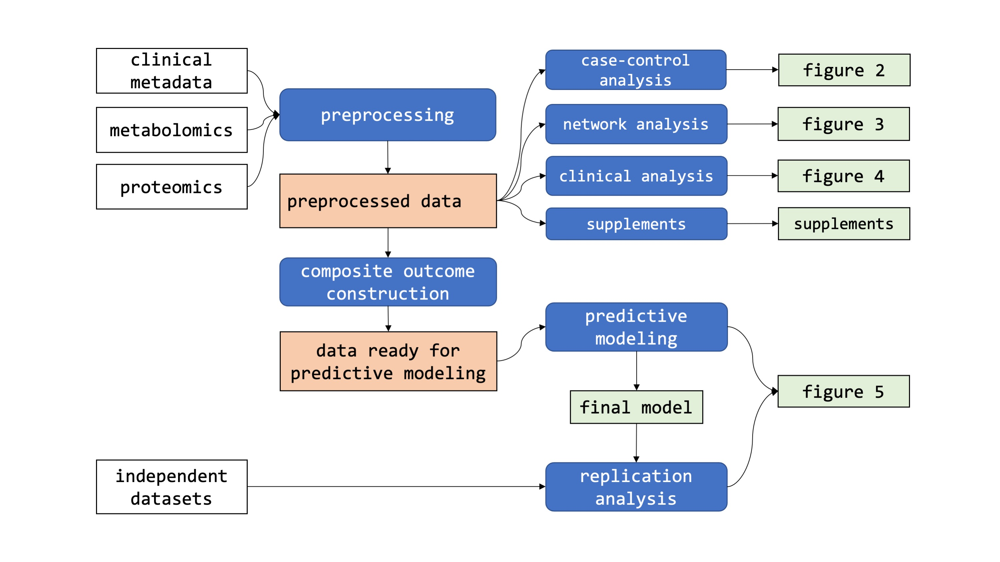

## Integrative Metabolomic and Proteomic Signatures Define Clinical Outcomes in Severe COVID-19

This repository contains the R code for Buyukozkan\*, Alvarez-Mulett\*, Racanelli\* et al., *Integrative Metabolomic and Proteomic Signatures Define Clinical Outcomes in Severe COVID-19*. https://doi.org/10.1101/2021.07.19.21260776

Each folder contains the codes for one analysis block of the paper:

* 1_preprocessing - Preprocessing of raw metabolomics/proteomics data
* 2a_casecontrol - Differential metabolomics/proteomics analysis of COVID-19 patients vs. controls
* 2b_clinical - Differential metabolomics/proteomics analysis of clinical parameters within  COVID-19 patients
* 2c_networks - GGM network analysis
* 2d_supplements - Analysis of intubation effects, time effects, and PCAs 
* 3a_composite - Composite outcome construction 
* 3b_prediction - Regularized linear mixed effect ordinal regression model 
* 4_replication - Model testing on independent datasets
* 5_paperfigures - Generation of paper figures 

## Data 

Download the study data from https://doi.org/10.6084/m9.figshare.19115972.v1. Clone this git repository and copy all data files into a "DATA/" subdirectory in the git folder.

## R environment

Note: During the first run, the main script will use the `renv` package to restore the correct versions of all required packages. This does not affect the system-wide library versions; all changes are stored in the local project.

## How to run the code

`main.R`: runs the entire pipeline by sourcing the all scripts listed below

- `run1_preprocessing.R`: runs all data preprocessing steps 
- `run2_allanalysis.R`: runs statistical association analysis and network analysis
- `run3_prediction.R`: runs predictive modeling 
- `run4_prediction.R`: runs replication analysis
- `run5_figures.R`: generates paper figures

*See [expected directory tree](expected_directory_tree.txt) after running all the code.*

## Overview of analysis pipeline 

